# Introduction to Genomic Data Visualization in R

---
## Course Purpose

## The purpose of this course is to provide students with a comprehensive introduction to the field of genomic data visualization using the R programming language.

---

## Genomics is a rapidly evolving and data-rich field, and the ability to effectively visualize and interpret genomic data is crucial for researchers and professionals working in genomics and bioinformatics.

## This course is designed to bridge the gap between genomics and data visualization, equipping students with the skills and knowledge necessary to extract meaningful insights from biological data through the creation and interpretation of various types of plots and graphs.

---

## By the end of this course, students will be able to:

- Develop a strong foundation in R programming
- Create and customize a wide range of **data visualizations**
- Proficiently use **Multidimensional Scaling (MDS)** for visualizing high-dimensional genomic data
- Generate and interpret **volcano plots** and **MA plots**
- Prepare and visualize **Gene Ontology (GO) data**
- Create customized **heat maps** in R

---

## Introduction to R for Bioinformatics

This course will emphasize the practical application of R rather than delving into its theoretical underpinnings. Nevertheless, a solid grasp of programming fundamentals is essential for gaining a deeper insight into R.

---

## R

R is a language and environment for statistical computing and graphics developed in the early 1990s. It provides a wide variety of statistical and graphical techniques, including linear and nonlinear modeling, statistical tests, time series analysis, classification, and clustering, among many others.

---

### R:

 - Is free!
 - Is open source and highly extensible, meaning that the user community can (and does) write new R tools
 - Makes publication quality figures, including mathematical symbols and formulae
 - Compiles and runs on Windows, MacOS, and a wide variety of UNIX and Linux systems
 - Has a large and active user community

There are many ways to use R: from the command line, from a script, or in a graphical interface, like RStudio.

---

## RStudio

RStudio is an integrated development environment (IDE), which offers:

 - Syntax highlighting
 - Code completion
 - Smart indentation
 - Workspace browser
 - Data viewer
 - Embedded plots
 - Notebooks that generate PDF or HTML results
 - Package management

---

### R Team Packages

The team behind RStudio are also the authors of a suite of R packages for data science and visualization collectively known as the “tidyverse.” We will be using their extremely popular plotting package, ggplot2, as well as a few other packages from the tidyverse suite later in this course.

---

## RStudio and R notebooks

To install R, go to https://cran.icts.res.in/

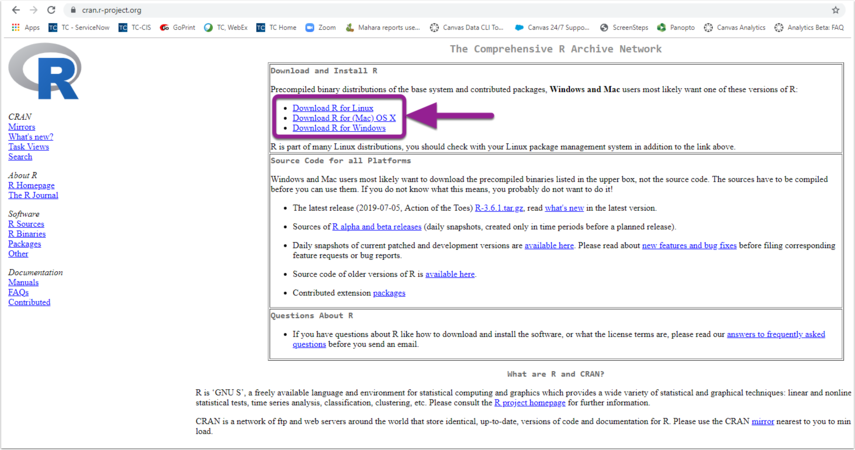

---
## Click on install R for the first time.
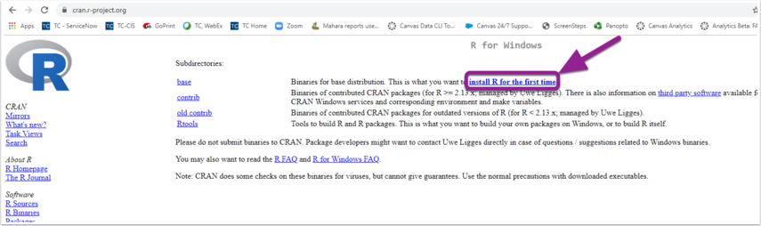

---

## Click Download R for Windows. Open the downloaded file.

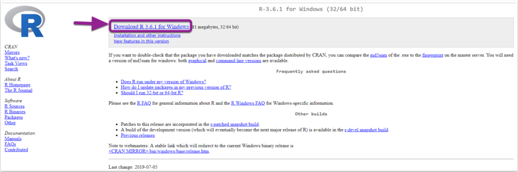

---

## Select the language you would like to use during the installation. Then click OK.

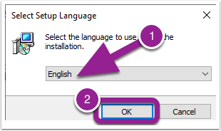

---

## Click Next.

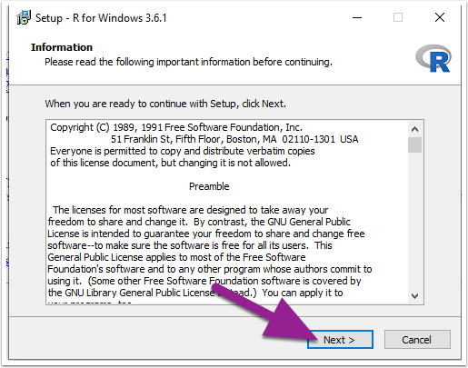

---

## Select where you would like R to be installed. It will default to your Program Files on your C Drive. Click Next.

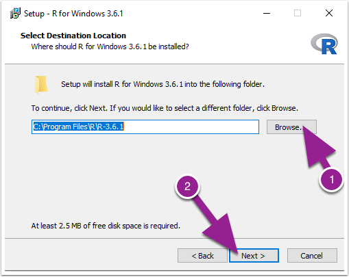

---

## You can then choose which installation you would like.

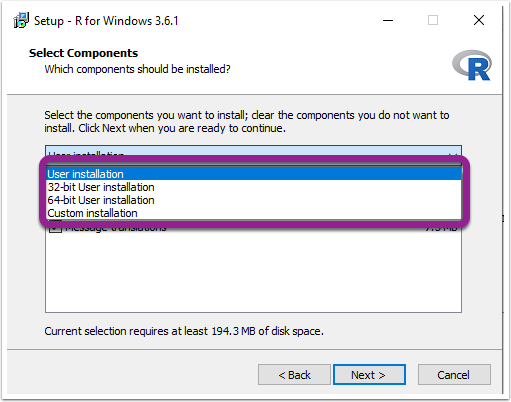

---

## (Optional) If your computer is a 64-bit, you can choose the 64-bit User Installation. Then click Next.

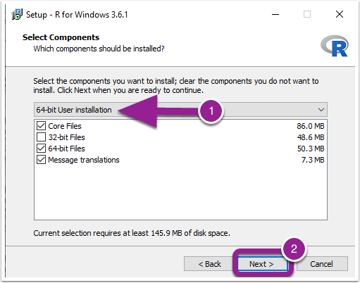

---

## Then specify if you want to customized your startup or just use the defaults. Then click Next.

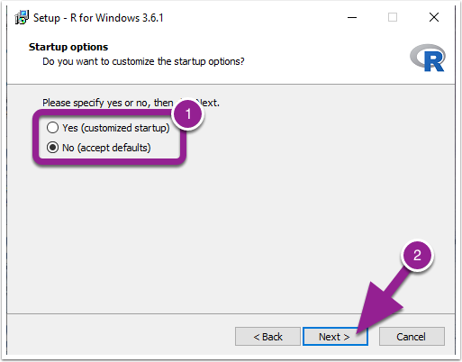

---

## Then you can choose the folder that you want R to be saved within or the default if the R folder that was created.  Once you have finished, click Next.

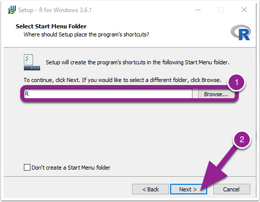

---

## You can then select additional shortcuts if you would like. Click Next.

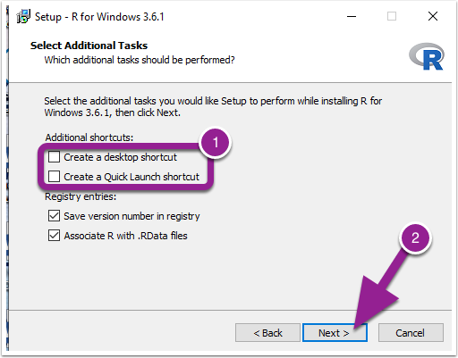

---

## Click Finish.

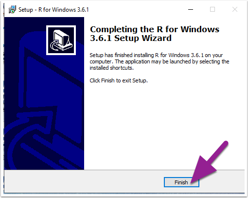

---

## Download RStudio. Go to https://posit.co/

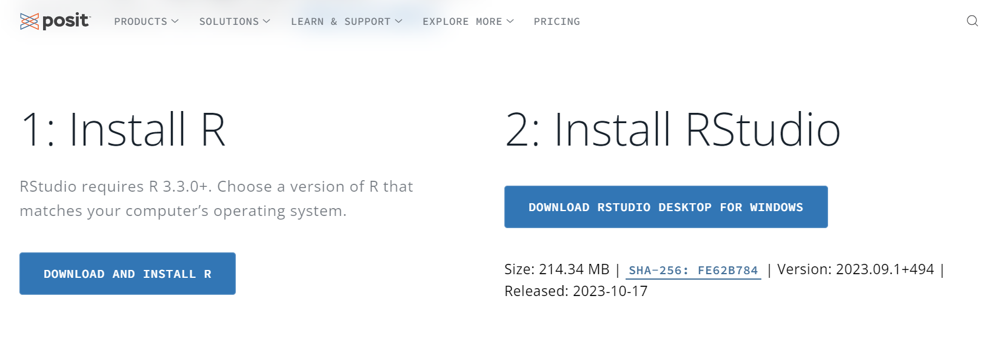

---

## The RStudio installation wizard will pop-up. Click Next and go through the installation steps.

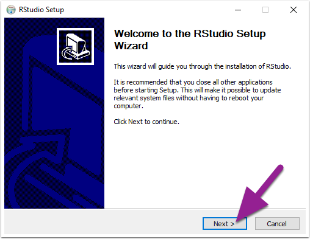

---

> **Launch RStudio**

## 1.1 RStudio

As mentioned above, RStudio is a very nice, but optional, IDE for R. All of the code for this course will work just as well on the command line, but RStudio provides a number of features that improve the experience of learning to the basics of R.

---

Your RStudio window should look something like this:

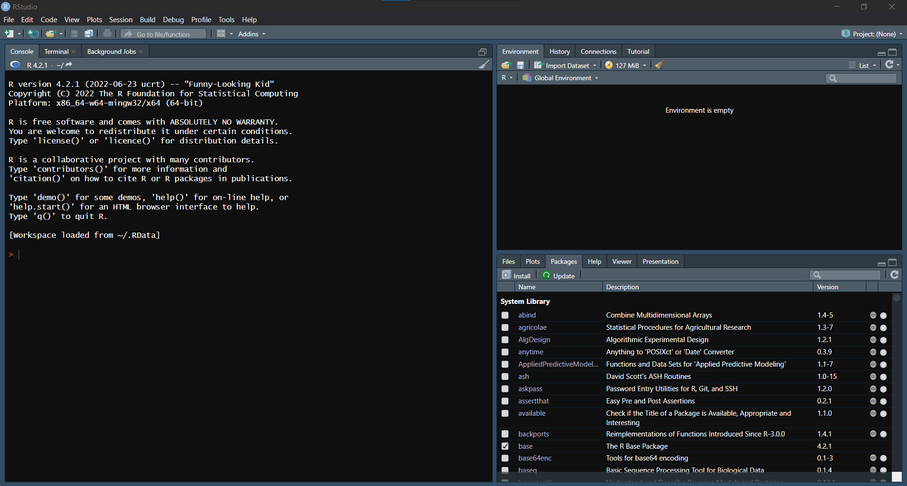

---

## 1.1.1 The console

On the left hand side is the console. This is a command-line interface for R; you type a command, press enter to run it, and the result will appear below.

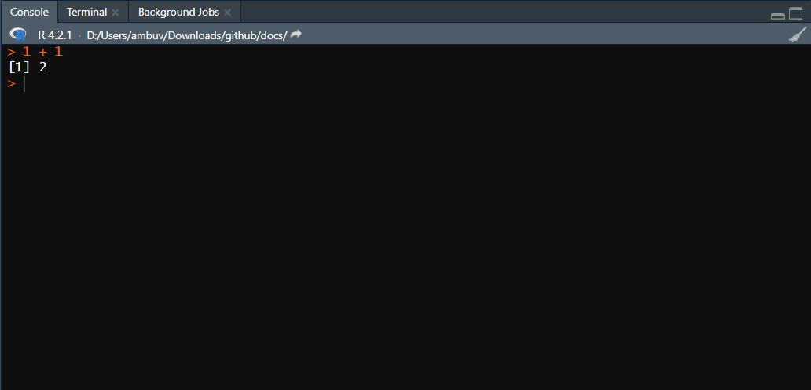

---

### Running a simple command

In R the prompt is a > character. When you see this character at the beginning of the line in your console, it means that R is waiting for you to type your next command.

In this course, code is going to appear in gray boxes, like this:

`1 + 1`

Whenever you see one of these boxes, try running the code yourself.

What happens if you press enter before you meant to?

`1 + `

---
### Running incomplete command

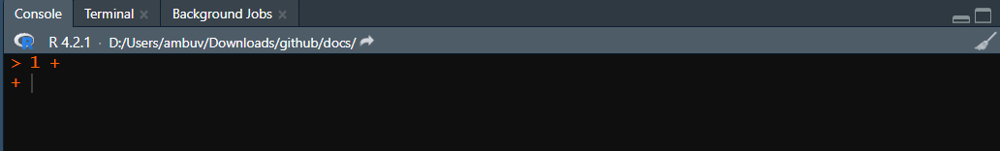

If you press enter before finishing a command, the next line will begin with a + character. This lets you know that R is expecting more input.

---

## 1.1.2 The workspace browser

In the upper right panel is the workspace (or environment) browser. This part of the window shows the objects present in the environment. Currently there are none.

The easiest way to explain an object is to run some code.

`a <- 1 + 1`

Unlike the first time we ran 1 + 1, nothing is printed to the console.

Instead, a new value appears in the workspace browser.

---

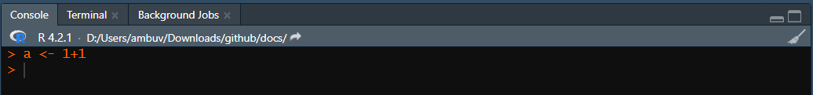

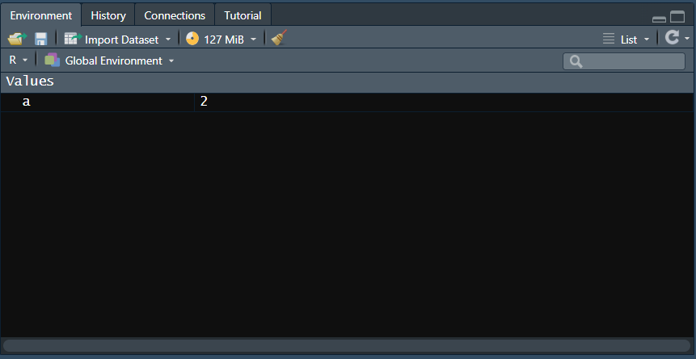

---

The *<-* is a special pair of characters called the assignment operator that stores the result of the addition in the object referred to on the left-hand side of the “arrow.”

Since no object called “a” existed in R’s environment, R created a new object “a” to hold the result of the addition operation 1 + 1.

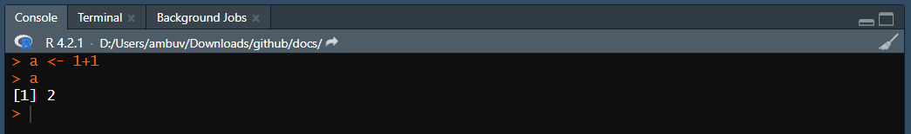

---

## 1.1.3 Help documentation

The lower right pane contains the file browser, plot viewer, and help documentation, which we will be using frequently.

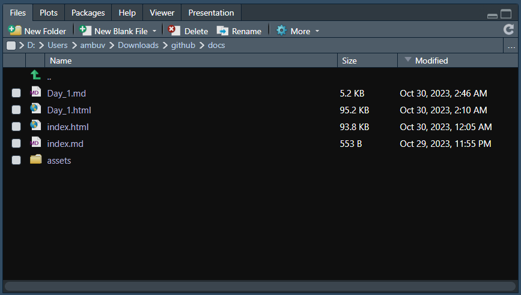

---

## 2 Importing and exporting data

For the remainder of this course, we will be working with a single data set to answer a number of simple biological questions about the effects of maternal cigarrette use during pregnancy. 

Begin by setting up a working directory for this course.

To make things easier, we’ll set R’s working directory to the directory named "workshop". To do this, select the “Session” menu in the toolbar, then navigate to “Set Working Directory,” and click on “Choose Directory.” Choose the "worksop" directory.

---

When you do so, you should see that a line of code ran in your console:

`setwd("D:/Users/ambuv/Desktop/workshop")`

_file names change based on individual systems_

### Download the data.

`download.file("https://raw.githubusercontent.com/ucdavis-bioinformatics-training/2022_February_Introduction_to_R_for_Bioinformatics/main/birthweight.csv", "birthweight.csv")`

---

## 2.1 Import data using read.csv()

R has a number of functions for reading data in a variety of formats. Let’s use the read.csv() function to read in a spreadsheet containing data from an experiment.

`birthweight <- read.csv("birthweight.csv")`

CSV stands for “comma separated value,” and the CSV file is simply a text file where each row in the file represents a row in the data table, and the columns are separated by commas. The contents of the CSV file are now stored in the variable “birthweight.”

---

## 2.2 Export data using write.csv()

To write the contents of the birthweight object to a new CSV, we can use the write.csv() function.

`write.csv(birthweight, file = "new_birthweight.csv")`

The similar `read.delim()` and `write.delim()` can be used to read and write tab-delimited files, where columns are separated by tab characters rather than commas.

---

## 3 Data frames

### 3.1 Structure of a data frame

Identify structure of our dataser using class() and dim() functions.

`class(birthweight)`

[1] "data.frame"

`dim(birthweight)`

[1] 42 18

_The “[1]” is not part of the output. It is an index added by R to help you keep track of the values when an operation outputs a large number of values._

---

### Let’s take a look at the contents.

`birthweight`

Outputs in the console

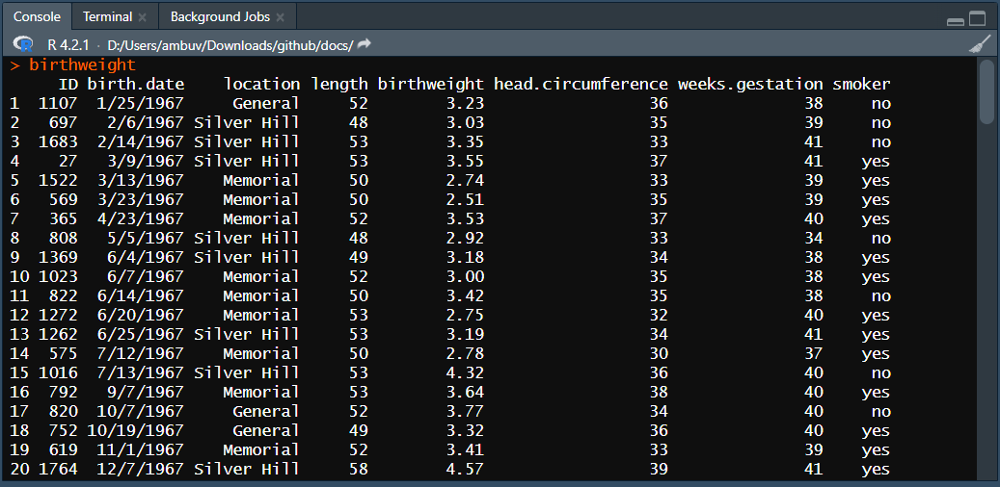

---

### To view in Source pane of Rstudio

`View(birthweight)`

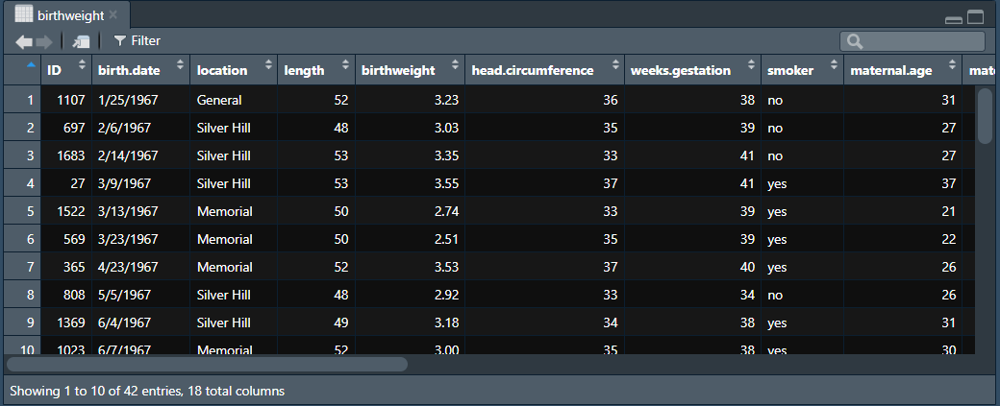

---

## View coloumn names

`colnames(birthweight)`

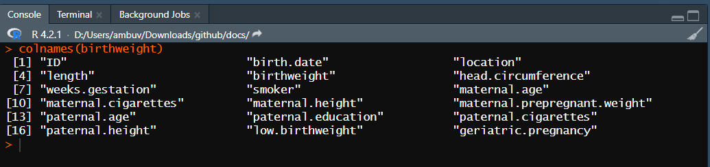

Now we know all the data we have.

Generally, we don’t want to operate on the entire data frame. For example, to calculate the mean birth weight, we don’t need the information in the “paternal.education” column.

---

## 3.2 Selecting a single column using the $ and [[ operators

There are three ways to have R subset the data frame: $, [[, and [.

The simplest way to get all the values in the “birthweight” column is with the $ operator.

`birthweight$birthweight`

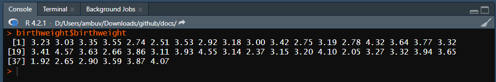

---

The numbers at the beginning of each line of output give us a general idea of the length of the vector, and allow us to determine the value of a particular observation at a glance.

_“what was the birth weight of the 34th baby?”_

Once the vector of birth weights has been extracted from the rest of the data frame, it can be used to calculate a **mean**.

`mean(birthweight$birthweight)`

[1] 3.312857

---

The $ operator is a shortcut for the [[* *]]. They function in the same way, returning the value of the element named.

`birthweight[["birthweight"]]`

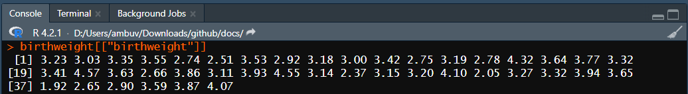

`mean(birthweight[["birthweight"]])`

[1] 3.312857

---
### Back to coloumnnames

`colnames(birthweight)`

`birthweight[[5]]`

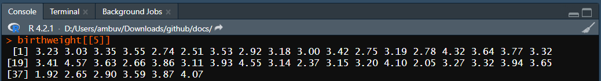

---

# Question

## “what was the birth weight of the 25th baby?”

Hint : Use $ and []

---

# Answer

`birthweight$birthweight[25]`

[1] 3.93

---

# Mean in a different way

`mean(birthweight[[5]])`

[1] 3.312857

### Avoid mistakes

_# the $ operator can't take an index_

`birthweight$5` will not work

---

# 3.3 Selecting a subset of the data frame using the [ operator

[ returns an object of the same type it is used to subset. 
Let's use [ to retrieve the fifth column, This will return a data frame with 42 rows and 1 column.

`birthweight[5]`

---

`birthweight[5]`

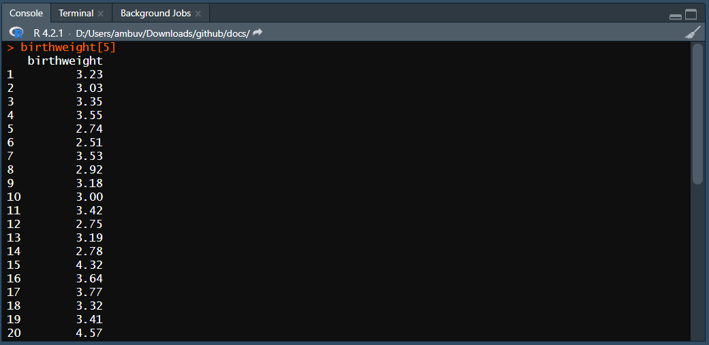

---

Because the [ operator returns a new data frame, it can be used to specify multiple **rows and / or columns**.

`birthweight[c(1,5)]`

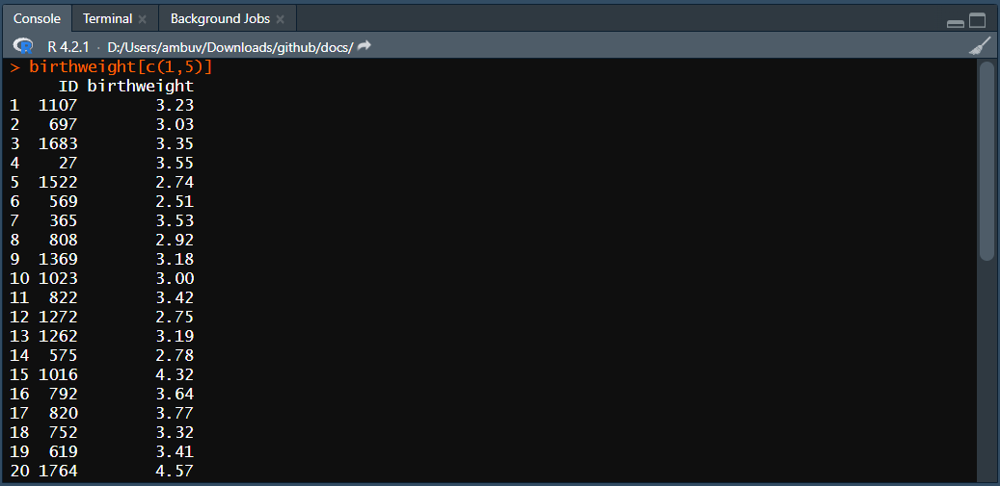

---

### Now what happens if c() is not used?

`birthweight[1, 5]`

[1] 3.23

This gives an output of 1st **row** and 5th **column** respectively.

You are basically reading a Matrix!

---

### Lets move into selecting multiple columns and rows

`birthweight[c(2,7,29), c(1,5)]`

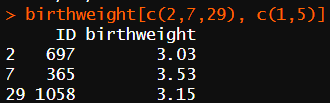

### Using a ""-"" before an index or group of indices will exclude the specified rows / columns and "":"" symbol will specify a range.

`birthweight[c(2,7,29), -c(1:15)]`

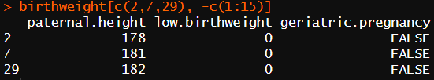

---

### R will also accept row or column names in quotations as a way to subset the data frame.

`birthweight[c("maternal.cigarettes", "birthweight")]`

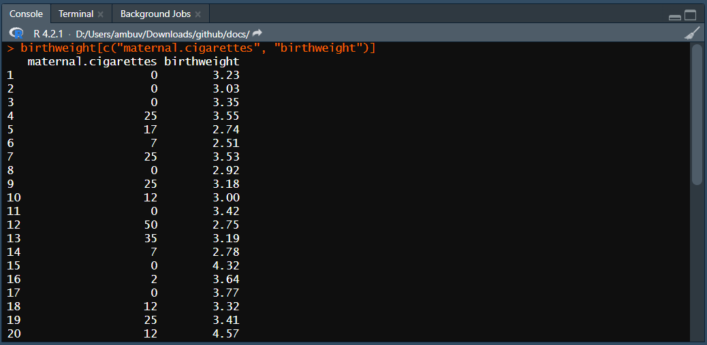

---

### Finally, vectors of logical (TRUE/FALSE) values can be used to subset data.
_Rows or columns corresponding to “TRUE” elements will be returned, while rows or columns corresponding to “FALSE” elements will be excluded._

`birthweight[c(1,3,5:13), c(TRUE, TRUE, TRUE, TRUE, TRUE, TRUE, TRUE, TRUE, TRUE, TRUE, TRUE, TRUE, FALSE, FALSE, FALSE, FALSE, TRUE, TRUE)]`

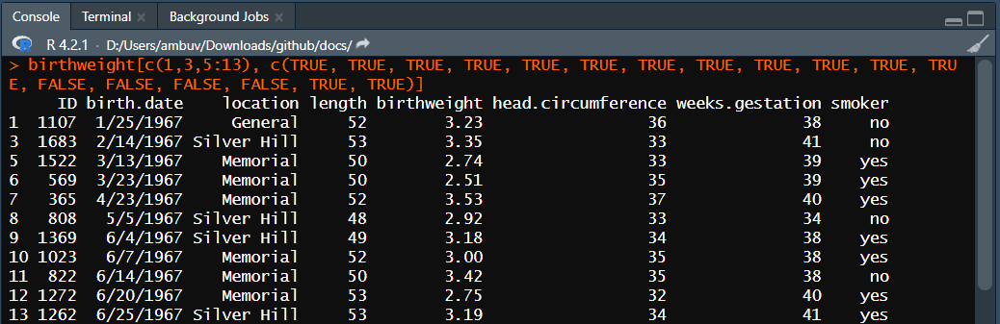

---

## Filtering using logical expressions

`birthweight$length`

`birthweight$length < 50`

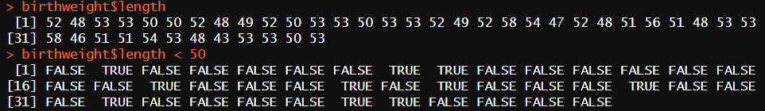

---

### Since the result of the `birthweight$length < 50` operation is a vector of *TRUE / FALSE* values, it can be used to subset the data frame.

`birthweight[birthweight$length < 50, c(1,4:12,17,18)]`

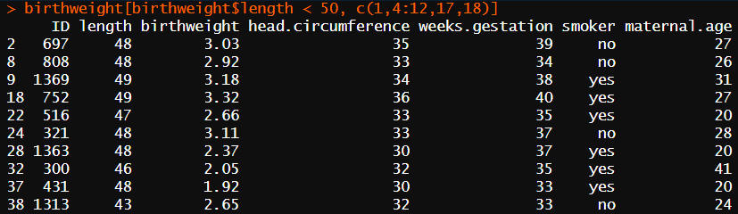

---

## 3.3.1 Subsetting a vector

A vector, like a column of a data frame, can be subsetted using the [ operator with an index or another vector.

`birthweight$length[1]`

[1] 52

`birthweight$length[c(1,2)]`

[1] 52 48

---

## 4 Basic data types

Now we know logical values can be used to subset a data frame, and all the values in a given column of a data frame must be of the same type or class.

### 4.1 Understanding class

R has the following basic data classes:

 - numeric (includes integer and double)
 - character
 - logical
 - complex
 - raw

Generally, in bioinformatics, values belong to one of the first three classes.

---

### Numeric

`class(birthweight$birthweight)`

[1] "numeric"

### Character

`class(birthweight$smoker)`

[1] "character"

### Logical

`class(birthweight$geriatric.pregnancy)`

[1] "logical"

---

## Heads and tails

head and tail commands are used to display the beginning or ending of a data.

`head(birthweight)`

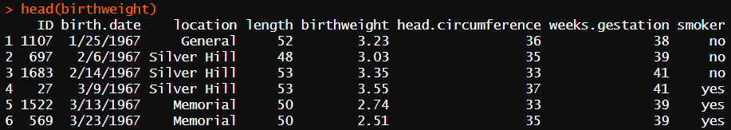

`head(birthweight$location)`

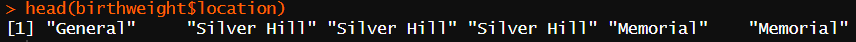

_Avoid this error : 1 + "1"_

---

# The relational operators in R are:

 - > greater than
 - >= greater than or equal to
 - < less than
 - <= less than or equal to
 - == equal to
 - != not equal to

---
## Example using > relational operators

`birthweight[birthweight$head.circumference > 35, c("length", "weeks.gestation", "maternal.height", "paternal.height")]`

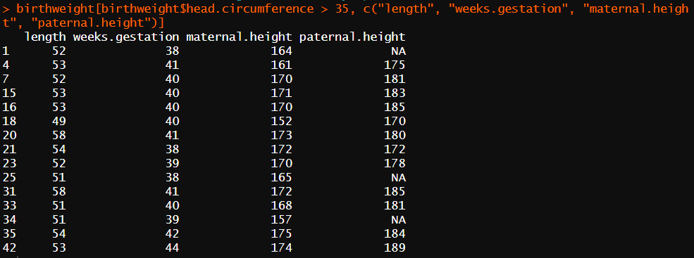

---

## Example using <= relational operators

`birthweight[birthweight$maternal.age <= 20, c("location", "maternal.age", "paternal.age")]`

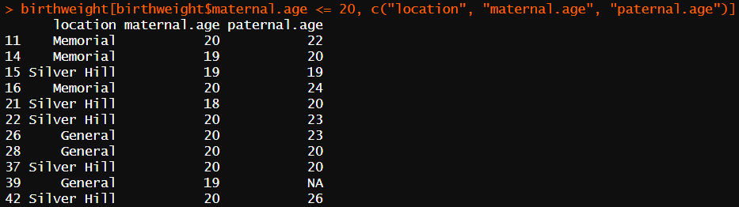

---

### Notice that when R is asked to perform a comparison between a number and a missing value, the result is a missing value.

`birthweight[birthweight$paternal.education == 10, c(1,13:16)]`

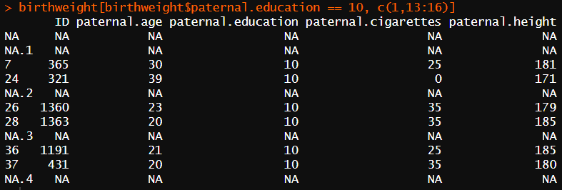

---
### Exclude all results that is equal to 40

`birthweight[birthweight$weeks.gestation != 40, "weeks.gestation"]`

 [1] 38 39 41 41 39 39 34 38 38 38 41 37 39 41 38 35 39 37 38 44 41 37 41 41 35
[26] 39 42 42 33 33 39 45 44

### Filtering only General

`birthweight[birthweight$location == "General",]`

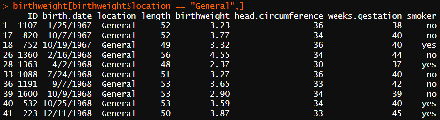

---

### Checking if all values in a column  is an integer.

`is.numeric(birthweight$ID)`

[1] TRUE

`is.numeric(birthweight$smoker)`

[1] FALSE

---

# 4.2 Coercion: converting between classes

The birthweight data frame has three columns that should probably be logical values: “smoker”, “low.birthweight”, and “geriatric.pregnancy”. 

Only “geriatric.pregnancy” is stored as a logical value. Storing “smoker” and “low.birthweight” as logical values would be more useful, since it allows us to subset the data frame more easily.

**Changing the class of data is known as coercion.**

`as.logical(birthweight$low.birthweight)`

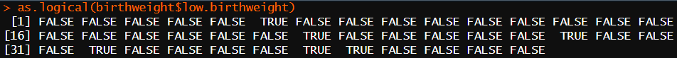

---

# The coercion rule in R is as follows:

**logical > integer > numeric > complex > character**

R can convert logical values to integers, store integers as the more general numeric type, or represent numeric data as a character, but these coercion operations cannot always be reversed without losing information.

_lets discuss some scenarios below._

---

### Logical to Integer Conversion
logical_value <- TRUE
integer_value <- as.integer(logical_value) # Convert TRUE to 1
print(integer_value)

### Integer to Numeric Conversion
integer_data <- 42
numeric_data <- as.numeric(integer_data) # Convert integer to numeric
print(numeric_data)

### Numeric to Character Conversion
numeric_data <- 3.14159
character_data <- as.character(numeric_data) # Convert numeric to character
print(character_data)

---

### Character to Numeric (with potential information loss)
character_number <- "123.45"
numeric_from_character <- as.numeric(character_number) # Convert character to numeric
print(numeric_from_character)

### Reversing Character to Numeric (with potential loss)
character_text <- "Hello, world!"
numeric_from_text <- as.numeric(character_text) # Attempt to convert text to numeric
print(numeric_from_text) # Output will be NA (Not Available) as text to numeric is not straightforward.

---

# Question : convert “smoker” from character to logical

Simple coercion is not going to convert the “smoker” column from character to logical.

How can you solve this problem?

---

# Answer

`birthweight$smoker == "yes"`

 [1] FALSE FALSE FALSE  TRUE  TRUE  TRUE  TRUE FALSE  TRUE  TRUE FALSE  TRUE
[13]  TRUE  TRUE FALSE  TRUE FALSE  TRUE  TRUE  TRUE FALSE  TRUE  TRUE FALSE
[25] FALSE FALSE  TRUE  TRUE FALSE FALSE FALSE  TRUE FALSE  TRUE FALSE FALSE
[37]  TRUE FALSE FALSE  TRUE  TRUE FALSE

## Replacing it in the parent database

`birthweight$smoker <- (birthweight$smoker == "yes")`

---

