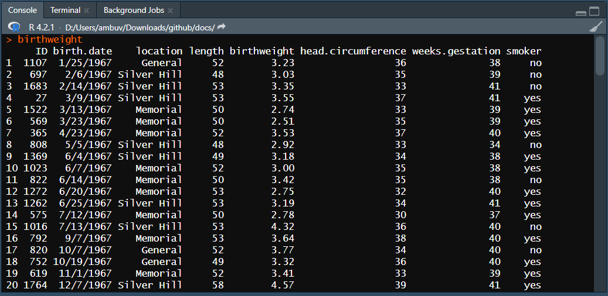
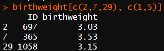
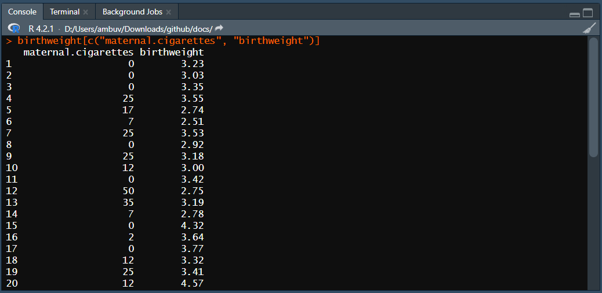
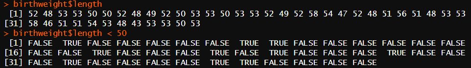
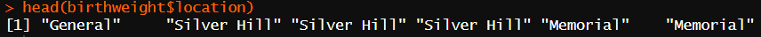
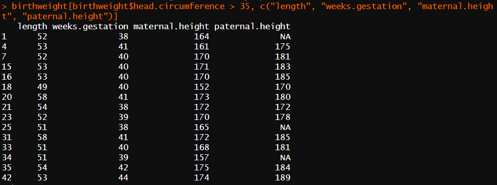
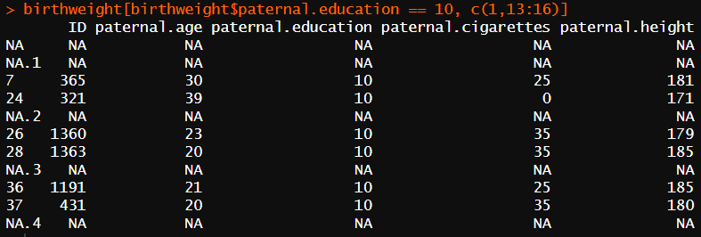
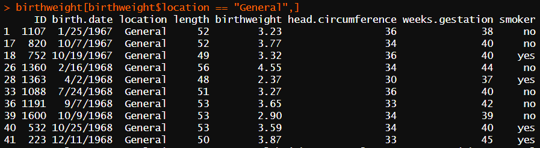

## Day 2 : Introduction to Genomic Data Visualization in R

## Ambu Vijayan
### Bioinformatician
### BioLit, Thiruvananthapuram
---

## 3 Data frames

### 3.1 Structure of a data frame

Identify structure of our dataser using class() and dim() functions.

`class(birthdata)`

[1] "data.frame"

`dim(birthdata)`

[1] 42 18

_The “[1]” is not part of the output. It is an index added by R to help you keep track of the values when an operation outputs a large number of values._

---

### Let’s take a look at the contents.

`birthdata`

Outputs in the console

---

### To view in Source pane of Rstudio

`View(birthdata)`

---

## View coloumn names

`colnames(birthdata)`

Now we know all the data we have.

Generally, we don’t want to operate on the entire data frame. For example, to calculate the mean birth weight, we don’t need the information in the “paternal.education” column.

---

## 3.2 Selecting a single column using the $ and [[ operators

There are three ways to have R subset the data frame: $, [[, and [.

The simplest way to get all the values in the “birthdata” column is with the $ operator.

`birthdata$birthweight`

---

The numbers at the beginning of each line of output give us a general idea of the length of the vector, and allow us to determine the value of a particular observation at a glance.

_“what was the birth weight of the 34th baby?”_

Once the vector of birth weights has been extracted from the rest of the data frame, it can be used to calculate a **mean**.

`mean(birthdata$birthweight)`

[1] 3.312857

---

The $ operator is a shortcut for the [[* *]]. They function in the same way, returning the value of the element named.

`birthdata[["birthdata"]]`

`mean(birthdata[["birthdata"]])`

[1] 3.312857

---
### Back to coloumnnames

`colnames(birthdata)`

`birthdata[[5]]`

---

# Question

## “what was the birth weight of the 25th baby?”

Hint : Use $ and []

---

# Answer

`birthdata$birthweight[25]`

[1] 3.93

---

# Mean in a different way

`mean(birthdata[[5]])`

[1] 3.312857

### Avoid mistakes

_# the $ operator can't take an index_

`birthdata$5` will not work

---

# 3.3 Selecting a subset of the data frame using the [ operator

[ returns an object of the same type it is used to subset. 
Let's use [ to retrieve the fifth column, This will return a data frame with 42 rows and 1 column.

`birthdata[5]`

---

`birthdata[5]`

---

Because the [ operator returns a new data frame, it can be used to specify multiple **rows and / or columns**.

`birthdata[c(1,5)]`

---

### Now what happens if c() is not used?

`birthdata[1, 5]`

[1] 3.23

This gives an output of 1st **row** and 5th **column** respectively.

You are basically reading a Matrix!

---

### Lets move into selecting multiple columns and rows

`birthdata[c(2,7,29), c(1,5)]`

### Using a ""-"" before an index or group of indices will exclude the specified rows / columns and "":"" symbol will specify a range.

`birthdata[c(2,7,29), -c(1:15)]`

---

### R will also accept row or column names in quotations as a way to subset the data frame.

`birthdata[c("maternal.cigarettes", "birthdata")]`

---

### Finally, vectors of logical (TRUE/FALSE) values can be used to subset data.
_Rows or columns corresponding to “TRUE” elements will be returned, while rows or columns corresponding to “FALSE” elements will be excluded._

`birthdata[c(1,3,5:13), c(TRUE, TRUE, TRUE, TRUE, TRUE, TRUE, TRUE, TRUE, TRUE, TRUE, TRUE, TRUE, FALSE, FALSE, FALSE, FALSE, TRUE, TRUE)]`

---

## Filtering using logical expressions

`birthdata$length`

`birthdata$length < 50`

---

### Since the result of the `birthdata$length < 50` operation is a vector of *TRUE / FALSE* values, it can be used to subset the data frame.

`birthdata[birthdata$length < 50, c(1,4:12,17,18)]`

---

# Observe that the [] function requires 2 components

## data[component1, component2]

## data[row, columns]

`birthdata[5, 10]`

`birthdata[c(2,7,29), c(1,5)]`

`birthdata[birthdata$length < 50, c(1,4:12,17,18)]`

---

## 3.3.1 Subsetting a vector

A vector, like a column of a data frame, can be subsetted using the [] operator with an index or another vector.

`birthdata$length[1]`

[1] 52

`birthdata$length[c(1,2)]`

[1] 52 48

---

## 4 Basic data types

Now we know logical values can be used to subset a data frame, and all the values in a given column of a data frame must be of the same type or class.

### 4.1 Understanding class

R has the following basic data classes:

 - numeric (includes integer and double)
 - character
 - logical
 - complex
 - raw

Generally, in bioinformatics, values belong to one of the first three classes.

---

### Numeric

`class(birthdata$birthweight)`

[1] "numeric"

### Character

`class(birthdata$smoker)`

[1] "character"

### Logical

`class(birthdata$geriatric.pregnancy)`

[1] "logical"

---

## Heads and tails

head and tail commands are used to display the beginning or ending of a data.

`head(birthdata)`

`head(birthdata$location)`

_Avoid this error : 1 + "1"_

---

# The relational operators in R are:

 - ">" greater than
 - ">=" greater than or equal to
 - "<" less than
 - "<=" less than or equal to
 - "==" equal to
 - "!=" not equal to

---
## Example using > relational operators

`birthdata[birthdata$head.circumference > 35, c("length", "weeks.gestation", "maternal.height", "paternal.height")]`

---

## Example using <= relational operators

`birthdata[birthdata$maternal.age <= 20, c("location", "maternal.age", "paternal.age")]`

---

### Notice that when R is asked to perform a comparison between a number and a missing value, the result is a missing value.

`birthdata[birthdata$paternal.education == 10, c(1,13:16)]`

---
### Exclude all results that is equal to 40

`birthdata[birthdata$weeks.gestation != 40, "weeks.gestation"]`

 [1] 38 39 41 41 39 39 34 38 38 38 41 37 39 41 38 35 39 37 38 44 41 37 41 41 35
[26] 39 42 42 33 33 39 45 44

### Filtering only General

`birthdata[birthdata$location == "General",]`

---

### Checking if all values in a column  is an integer.

`is.numeric(birthdata$ID)`

[1] TRUE

`is.numeric(birthdata$smoker)`

[1] FALSE

---

# 4.2 Coercion: converting between classes

The birthdata data frame has three columns that should probably be logical values: “smoker”, “low.birthdata”, and “geriatric.pregnancy”. 

Only “geriatric.pregnancy” is stored as a logical value. Storing “smoker” and “low.birthdata” as logical values would be more useful, since it allows us to subset the data frame more easily.

**Changing the class of data is known as coercion.**

`as.logical(birthdata$low.birthdata)`

---

# The coercion rule in R is as follows:

**logical > integer > numeric > complex > character**

R can convert logical values to integers, store integers as the more general numeric type, or represent numeric data as a character, but these coercion operations cannot always be reversed without losing information.

_lets discuss some scenarios below._

---

### Logical to Integer Conversion
`logical_value <- TRUE`

`integer_value <- as.integer(logical_value)`

`print(integer_value)`

### Integer to Numeric Conversion
`integer_data <- 42`

`numeric_data <- as.numeric(integer_data)`

`print(numeric_data)`

---
### Numeric to Character Conversion
`numeric_data <- 3.14159`

`character_data <- as.character(numeric_data)`

`print(character_data)`

### Character to Numeric (with potential information loss)
`character_number <- "123.45"`

`numeric_from_character <- as.numeric(character_number)` 

`print(numeric_from_character)`

---

### Reversing Character to Numeric (with potential loss)
character_text <- "Hello, world!"

numeric_from_text <- as.numeric(character_text)

print(numeric_from_text) 

Output will be NA (Not Available) as text to numeric is not straightforward.

---

# Question : convert “smoker” from character to logical

Simple coercion is not going to convert the “smoker” column from character to logical.

How can you solve this problem?

---

# Answer

`birthdata$smoker == "yes"`

 [1] FALSE FALSE FALSE  TRUE  TRUE  TRUE  TRUE FALSE  TRUE  TRUE FALSE  TRUE
[13]  TRUE  TRUE FALSE  TRUE FALSE  TRUE  TRUE  TRUE FALSE  TRUE  TRUE FALSE
[25] FALSE FALSE  TRUE  TRUE FALSE FALSE FALSE  TRUE FALSE  TRUE FALSE FALSE
[37]  TRUE FALSE FALSE  TRUE  TRUE FALSE

## Replacing it in the parent database

`birthdata$smoker <- (birthdata$smoker == "yes")`
