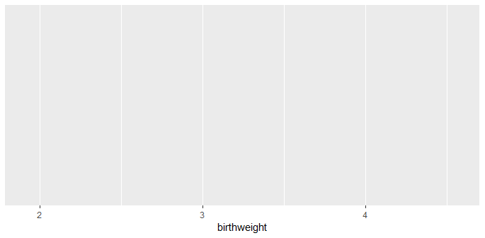
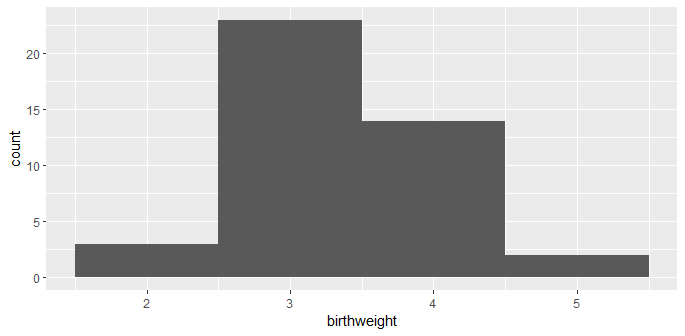
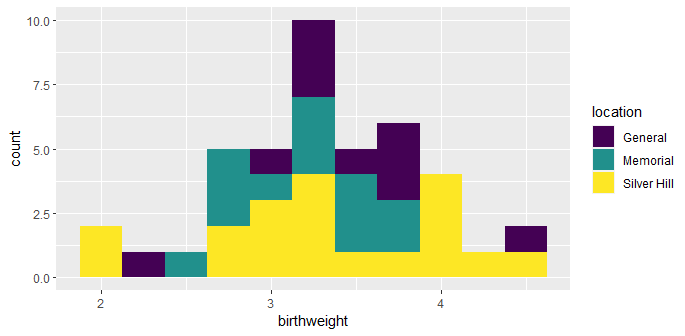
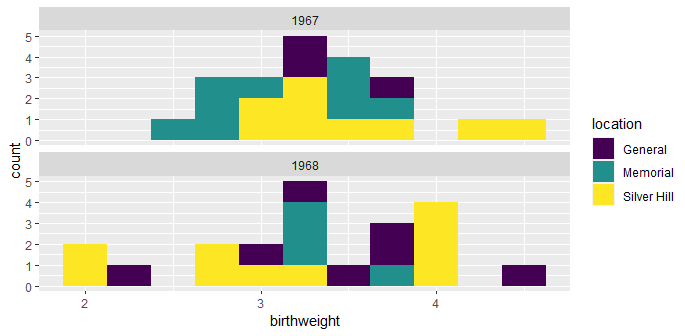
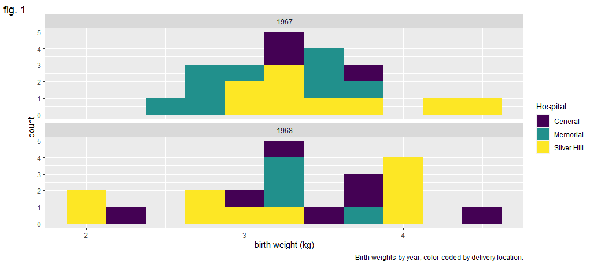
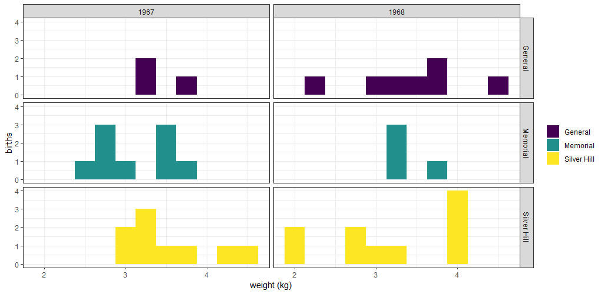
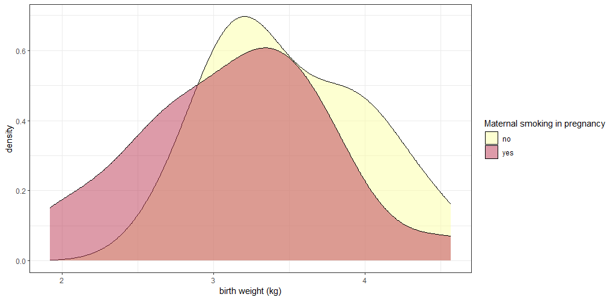
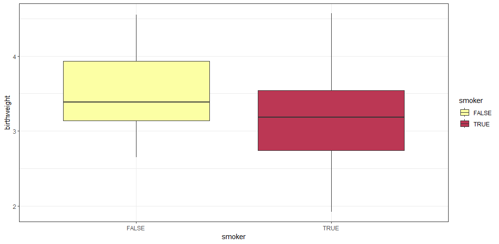
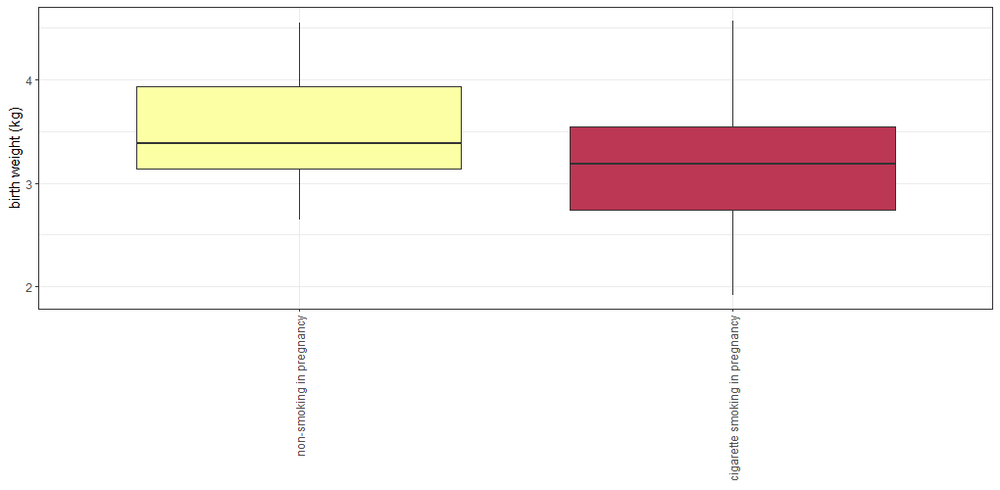

## Day 3 : Data Visualization Fundamentals in R

## Ambu Vijayan
### Bioinformatician
### BioLit, Thiruvananthapuram
---

# Data Manipulation in R

Consider the code for calculating mean of birthweight earlier.

`mean(birthdata$birthweight)`

Now Observe this command,

`mean(birthdata$birthweight[birthdata$geriatric.pregnancy])`

What do you think this code does?

---

### `mean(birthdata$birthweight[birthdata$geriatric.pregnancy])`

The R code calculates the mean (average) birthweight of babies in birthdata dataset based on a condition specified in the `geriatric.pregnancy` column. 

Let me break it down step by step:

`birthdata$geriatric.pregnancy`

This part extracts the values in the **geriatric.pregnancy** column of the **birthdata** dataset. 

This column contains binary values (TRUE or FALSE) indicating whether a pregnancy is classified as a geriatric pregnancy.

---

`birthdata$birthweight[birthdata$geriatric.pregnancy]`

This part subsets the `birthdata$birthweight` column based on the condition in `birthdata$geriatric.pregnancy`. 

In other words, it extracts the birthweights of babies where `geriatric.pregnancy` is TRUE.

---

`mean(...)`

It calculates the mean (average) of the birthweights obtained in the previous step.

This gives you the average birthweight of babies born to mothers with geriatric pregnancies.

Now run the code :

`mean(birthdata$birthweight[birthdata$geriatric.pregnancy])`

---

# How to handle missing data

Run this code :

`mean(birthdata$paternal.age)`

You will get an output *NA*

*NA* stands for *Not Available*

### Go through your dataset to check if you have NA.

---

# Installing an R package : fixr

For finding which all columns have how many of the NAs in our database, Lets use a package called **fixr**

CRAN is the repository where we download ll packages in R.

The link for fixr is : https://cran.r-project.org/web/packages/fixr/index.html

Reference manual of fixr : https://cran.r-project.org/web/packages/fixr/fixr.pdf

We will use a function called `check_missing_values` from this package.

---
## There are two ways: By code or By IDE

## Using IDE

Use the install option from packages tab

---

Search for fixr package

Click Install.

---

## Installation by code

`install.packages("fixr")`

---

# Activating a package

## There are two ways: By code or By IDE

## Using IDE

Check the tock box near fixr in packages tab

---

## Using Code

`library(fixr)`

Use `help(package = "fixr")` to learn more about this package

---

# Finding NAs in a dataset

Lets use check_missing_values function in fixr package.

`check_missing_values(birthdata)`

Outputs the name of columns and number of NAs in them.

Now we know that paternal.age has 4 NAs.

---

# How to handle NAs

Lets go back to :

`mean(birthdata$paternal.age)`

We need to specify mean function not to use the NAs or to omit the rows with NAs.

For that we use : `na.rm = TRUE` along with our mean command.

## Below command will omit rows with NAs

`mean(birthdata$paternal.age, na.rm = TRUE)`

---

# Splitting a data into meaning full data

Consider column **birth.date**

`birthdata$birth.date`

We cant use this data to calculate any meaning full result.

Lets split this data into Day, Month and Year

---

# strsplit() function

Lets use this function to split the date, We specify dates are separated using "/" symbol.

`strsplit(birthdata$birth.date, split = "/")`

Lets assign this to an object called dates.

`dates_list <- strsplit(birthdata$birth.date, split = "/")`

Check the class of dates : `class(dates_list)`

*The output of strsplit() is a list containing 42 vectors of length 3, while the columns of birthweight are vectors of length 42.*

---

# The apply() family of functions

apply takes a matrix, applies a function either by row or by column, and returns a vector.

IMPORTANT there are 2 axis for a matrix

**Axis 1 is row**

**Axis 2 is column**

So command for apply is :

`apply(dataset[rows,columns], axis1/axis2, operation)`

---

Lets add total of "maternal.cigarettes" and "paternal.cigarettes" in all rows. 

`apply(birthdata[,c("maternal.cigarettes", "paternal.cigarettes")], 1, sum)`

Which gives total of maternal and paternal cigarettes.

`apply(birthdata[,c("maternal.cigarettes", "paternal.cigarettes")], 2, sum)`

Which gives total of maternal cigarettes column and paternal cigarettes column individually.

maternal.cigarettes : 396
paternal.cigarettes : NA (as data has missing values)

How to omit NAs and get a meaning full result here?

`apply(birthdata[,c("maternal.cigarettes", "paternal.cigarettes")], 2, sum, na.rm=T)`

---

# mapply

mapply takes a function and applies it to the elements of one or more vectors.

`mapply(sum, birthdata$maternal.cigarettes, birthdata$paternal.cigarettes)`

Result is same as using axis 1 in apply function.

---

# tapply

tapply takes two vectors, applies a function to the subsets of the first based on the categories in the second vector, and returns a table.

`tapply(birthdata$birthweight, birthdata$smoker, mean)`

No : 3.509500 
Yes : 3.134091 

---

# lapply

lapply takes a list, applies a function to each element, and returns a list.

**For Month**

lapply(strsplit(birthdata$birth.date, split = "/"), '[[', 1)

**For Date**

lapply(strsplit(birthdata$birth.date, split = "/"), '[[', 2)

**For Year**

lapply(strsplit(birthdata$birth.date, split = "/"), '[[', 3)

---

# Difference of [ and [[

[ (Single Square Bracket):
[ is used for subsetting objects, such as vectors, lists, and data frames.

[[ (Double Square Bracket):
[[ is used for extracting a single element from a list or data frame. It is specifically designed for accessing elements inside lists and data frame

`my_list <- list(a = 1, b = 2, c = 3)`

`my_list[2]`

`my_list[[2]]`

---

# do.call

The do.call() function in R is used to apply a function to a list of arguments. It takes two main arguments:

1. what: This argument specifies the function to be called.

2. args: This argument is a list of arguments to pass to the function.

`do.call(what, args)`

---

# cbind

## cbind (Column Bind):

The cbind() function is used to combine two or more objects (vectors, matrices, or data frames) by column. It effectively stacks the objects side by side, creating a new data structure.

`coldata <- cbind(birthdata$location, birthdata$length)`

`View(coldata)`

---

# rbind

## rbind (Row Bind):

The rbind() function is used to combine two or more objects (vectors, matrices, or data frames) by row. It effectively stacks the objects on top of each other, creating a new data structure.

`rowdata <- rbind(birthdata$location, birthdata$length)`

`View(rowdata)`

---

# Combining what we learned for splitting dates

## Splitting dates into a list

`dates_list <- strsplit(birthdata$birth.date, split = "/")`

`class(dates_list)`

## Combining list into a matrix 

`dates_matrix <- do.call(rbind, dates_list)`

`class(dates_matrix)`

---

## Converting matrix into data frame

`dates_df <- data.frame(dates_matrix)`

`class(dates_df)`

## Naming the column as month, day and year

`names(dates_df) = c("month", "day", "year")`

## Add the new columns to the birthdata data frame

`birthdata <- cbind(birthdata, date_df)`

`View(birthdata)`

---

# Using apply functions for splitting dates

## Split the dates into month, day, and year using sapply

`dates <- sapply(strsplit(birthdata$birth.date, split = "/"), as.integer)`

## Transpose the dates matrix
`dates <- t(dates)`

`View(dates)`

## Create a data frame from the transposed matrix and 

`date_df <- data.frame(dates)`

`View(date_df)`

---

## Give it column names
`colnames(date_df) <- c("month", "day", "year")`

## Add the new columns to the birthdata data frame

`birthdata <- cbind(birthdata, date_df)`

`View(birthdata)`

---

# Exercise 3: summarizing the data

Answer the following questions to answer, or come up with one of your own. Work together. 

Once you’ve answered a question in one way, can you come up with alternate code that generates the same answer?

1. Are preterm babies more likely to have low birth weight?

2. What is the ratio of maternal cigarettes to paternal cigarettes for births at each of the hospitals?

3. Do taller mothers have taller partners? Do they have longer babies?

---

# Visualizations

The ggplot2 library is an extremely popular visualization package that provides an interface for extremely fine control over graphics for plotting.

---

# Install ggplot2 and viridis

`install.packages("ggplot2")`

`library(ggplot2)`

`install.packages("viridis")`

`library(viridis)`

*Viridis is Colorblind-Friendly Color Maps for R*

---

# ggplot2

`?ggplot`

`ggplot(data = birthdata, mapping = aes(x = birthweight))`

This outputs a blank canvas.

---

# geom

There are 30 geoms in the ggplot2 library, lets start with histogram.

`ggplot(data = birthdata, mapping = aes(x = birthweight)) + geom_histogram()`

But we get a warning : *`stat_bin()` using `bins = 30`. Pick better value with `binwidth`*`

---

`ggplot(data = birthdata, mapping = aes(x = birthweight)) + geom_histogram(binwidth = 1)`

---

`ggplot(data = birthdata, mapping = aes(x = birthweight)) + geom_histogram(binwidth = 0.25)`

---

# Adding color (and fill) to geoms

`ggplot(data = birthdata, mapping = aes(x = birthweight, fill = location)) + geom_histogram(binwidth = 0.25)`

---

# Making it colorblind friendly palette

`locations.palette <- viridis(3)`

`ggplot(data = birthdata, mapping = aes(x = birthweight, fill = location)) + geom_histogram(binwidth = 0.25) + scale_fill_manual(values = locations.palette)`

---

# Creating faceted plots

Create multiple sub-plots or “facets” based on categorical values in the data.

The facet_wrap() and facet_grid() functions allow the user to break the data down into multiple plots by one or two categorical variables, respectively.

ggplot(data = birthdata, mapping = aes(x = birthweight, fill = location)) + geom_histogram(binwidth = 0.25) + scale_fill_manual(values = locations.palette) + facet_wrap(~year, nrow = 2)

---

## We used facet_wrap to year and grid rows as 2.

---

# Add and modify labels

The labs() function offers the option to set the following labels:

 - any aesthetic that has been set: in this case, x and fill
 - title: main title of the plot
 - subtitle: displayed below the title
 - caption: displayed at the bottom right of the plot by default
 - tag: label that appears at the top left of the plot by default (e.g. 1A)
 - alt, alt_insight: alt text for the plot (used by screen readers)

---

# Add and modify labels

`ggplot(data = birthdata, mapping = aes(x = birthweight, fill = location)) + geom_histogram(binwidth = 0.25) + scale_fill_manual(values = locations.palette) + facet_wrap(~year, nrow = 2) + labs(x = "birth weight (kg)", fill = "Hospital", tag = "fig. 1", caption = "Birth weights by year, color-coded by delivery location.", alt = "Pair of histograms displaying the distribution of birth weights of infants born at General Hospital, Memorial Hospital, and Silver Hill Medical Center in 1967 and 1968.")`

---
## Breaking down the command

 - ggplot(data = birthdata, mapping = aes(x = birthweight, fill = location)) + 
 - geom_histogram(binwidth = 0.25) + 
 - scale_fill_manual(values = locations.palette) + 
 - facet_wrap(~year, nrow = 2) + 
 - labs(x = "birth weight (kg)", 
     - fill = "Hospital", 
     - tag = "fig. 1", 
     - caption = "Birth weights by year, color-coded by delivery location.", 
     - alt = "Pair of histograms displaying the distribution of birth weights of infants born at General Hospital, Memorial Hospital, and Silver Hill Medical Center in 1967 and 1968.")

---

---

# Plot Themes

`ggplot(data = birthdata, mapping = aes(x = birthweight, fill = location)) +
geom_histogram(binwidth = 0.25) +
scale_fill_manual(values = locations.palette) +
facet_grid(location~year) +
labs(x = "weight (kg)", y = "births") +
theme_bw() +
theme(legend.title = element_blank())`

 - ggplot(data = birthdata, mapping = aes(x = birthweight, fill = location)) +
 - geom_histogram(binwidth = 0.25) +
 - scale_fill_manual(values = locations.palette) +
 - facet_grid(location~year) +
 - labs(x = "weight (kg)", y = "births") +
 - theme_bw() +
 - theme(legend.title = element_blank())

---

---

# geom_density()

## lets create a new color blind palette

`smoking.palette <- inferno(2, begin = 0.5, direction = -1)`

`?inferno` to learn more bout this.

`ggplot(data = birthdata, mapping = aes(x = birthweight, fill = smoker)) +
geom_density(alpha = 0.5) +
scale_fill_manual(values = smoking.palette) +
labs(x = "birth weight (kg)", fill = "Maternal smoking in pregnancy") +
theme_bw()`

---

# geom_density() plot

---

# geom_point()

### Filter out smokers from birthdata

`filtered_data <- birthdata[birthdata$smoker == TRUE, ]`

### Plot using geom point

`ggplot(data = filtered_birthdata, mapping = aes(x = maternal.cigarettes, y = weeks.gestation, color = birthweight)) +
geom_point()  + labs(x = "Maternal cigarettes / day", y = "Gestational age at birth (weeks)", color = "Birth weight (kg)") +
scale_color_viridis(option = "inferno", begin = 0.4) + theme_bw()`

---

# geom_point() plot

No need to specify a color palette; viridis has a built-in function for  ggplot objects.

---

# geom_boxplot()

`ggplot(data = birthdata, mapping = aes(x = smoker, y = birthweight, fill = smoker)) +
geom_boxplot() +
scale_fill_manual(values = smoking.palette) +
theme_bw()`

The labels on a categorical axis should be meaningful.

The bar chart above displays the values “TRUE” and “FALSE” on the x-axis.

---

# geom_boxplot() plot

---

# geom_boxplot() for Publications

In a report or publication, it might be more informative to replace “TRUE” and “FALSE” with “smoker” and “non-smoker.” 

The scale_x_discrete() function is used to do that.

`ggplot(data = birthdata, mapping = aes(x = smoker, y = birthweight, fill = smoker)) +
geom_boxplot() +
scale_fill_manual(values = smoking.palette) +
scale_x_discrete(labels = c("non-smoker", "smoker")) +
guides(fill = "none") +
labs(y = "birth weight (kg)", x = "maternal cigarette use in pregnancy") +
theme_bw()`

---

# geom_boxplot() for Publications Plot

---

# Changing the direction of axes labels

`ggplot(data = birthdata, mapping = aes(x = smoker, y = birthweight, fill = smoker)) +
geom_boxplot() +
scale_fill_manual(values = smoking.palette) +
scale_x_discrete(labels = c("non-smoking in pregnancy", "cigarette smoking in pregnancy")) +
guides(fill = "none") +
labs(y = "birth weight (kg)") +
theme_bw() +
theme(axis.title.x = element_blank(),
axis.text.x = element_text(angle = 90, vjust = 0.5, hjust = 1))`

This last part helps us change angles of labels

` + theme(axis.title.x = element_blank(),
axis.text.x = element_text(angle = 90, vjust = 0.5, hjust = 1))`

---

# Changed label axis plot

---

# Changing the direction of axes itself

`ggplot(data = birthdata, mapping = aes(x = smoker, y = birthweight, fill = smoker)) + geom_boxplot() +
scale_fill_manual(values = smoking.palette) +
scale_x_discrete(labels = c("non-smoking in pregnancy", "cigarette smoking in pregnancy")) +
guides(fill = "none") +
labs(y = "birth weight (kg)") +
coord_flip() +
theme_bw() +
theme(axis.title.y = element_blank())`

This last part helps us change angles of axis itself

` + coord_flip()`

---
# Changed axis plot

---

# Layer multiple geoms

## We used geom_point and geom_smooth here together.

`ggplot(birthdata, mapping = aes(x = weeks.gestation,
y = birthweight,
color = smoker)) +
geom_point() +
geom_smooth(alpha = 0.2) +
labs(x = "Gestational age at birth (weeks)",
y = "Birth weight (kg)",
color = "Maternal tobacco use",
caption = "Birthweight increases with gestational age for infants born to both\nsmokers and non-smokers.") +
scale_color_manual(values = smoking.palette) +
theme_bw() +
theme(plot.caption = element_text(hjust = 0))`

---

# multiple geoms plot

---

## Remember : 

If its point or line of colors, then :

color = data

from above examples : `color = smoker`

### Also,

If its an area to be filled by a color, then :

fill = data

from above examples : `fill = smoker`

