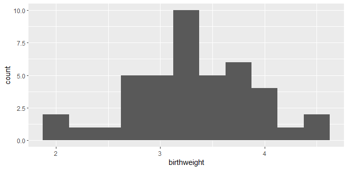

## Day 3 : Data Visualization Fundamentals in R

## Ambu Vijayan
### Bioinformatician
### BioLit, Thiruvananthapuram
---

# Visualizations

The ggplot2 library is an extremely popular visualization package that provides an interface for extremely fine control over graphics for plotting.

---

# Install ggplot2 and viridis

`install.packages("ggplot2")`

`library(ggplot2)`

`install.packages("viridis")`

`library(viridis)`

*Viridis is Colorblind-Friendly Color Maps for R*

---

# ggplot2

`?ggplot`

`ggplot(data = birthdata, mapping = aes(x = birthweight))`

This outputs a blank canvas.

---

# geom

There are 30 geoms in the ggplot2 library, lets start with histogram.

`ggplot(data = birthdata, mapping = aes(x = birthweight)) + geom_histogram()`

But we get a warning : *`stat_bin()` using `bins = 30`. Pick better value with `binwidth`*`

---

`ggplot(data = birthdata, mapping = aes(x = birthweight)) + geom_histogram(binwidth = 1)`

---

`ggplot(data = birthdata, mapping = aes(x = birthweight)) + geom_histogram(binwidth = 0.25)`

---

# Adding color (and fill) to geoms

`ggplot(data = birthdata, mapping = aes(x = birthweight, fill = location)) + geom_histogram(binwidth = 0.25)`

---

# Making it colorblind friendly palette

`locations.palette <- viridis(3)`

`ggplot(data = birthdata, mapping = aes(x = birthweight, fill = location)) + geom_histogram(binwidth = 0.25) + scale_fill_manual(values = locations.palette)`

---

# Creating faceted plots

Create multiple sub-plots or “facets” based on categorical values in the data.

The facet_wrap() and facet_grid() functions allow the user to break the data down into multiple plots by one or two categorical variables, respectively.

ggplot(data = birthdata, mapping = aes(x = birthweight, fill = location)) + geom_histogram(binwidth = 0.25) + scale_fill_manual(values = locations.palette) + facet_wrap(~year, nrow = 2)

---

## We used facet_wrap to year and grid rows as 2.

---

# Add and modify labels

The labs() function offers the option to set the following labels:

 - any aesthetic that has been set: in this case, x and fill
 - title: main title of the plot
 - subtitle: displayed below the title
 - caption: displayed at the bottom right of the plot by default
 - tag: label that appears at the top left of the plot by default (e.g. 1A)
 - alt, alt_insight: alt text for the plot (used by screen readers)

---

# Add and modify labels

`ggplot(data = birthdata, mapping = aes(x = birthweight, fill = location)) + geom_histogram(binwidth = 0.25) + scale_fill_manual(values = locations.palette) + facet_wrap(~year, nrow = 2) + labs(x = "birth weight (kg)", fill = "Hospital", tag = "fig. 1", caption = "Birth weights by year, color-coded by delivery location.", alt = "Pair of histograms displaying the distribution of birth weights of infants born at General Hospital, Memorial Hospital, and Silver Hill Medical Center in 1967 and 1968.")`

---
## Breaking down the command

 - ggplot(data = birthdata, mapping = aes(x = birthweight, fill = location)) + 
 - geom_histogram(binwidth = 0.25) + 
 - scale_fill_manual(values = locations.palette) + 
 - facet_wrap(~year, nrow = 2) + 
 - labs(x = "birth weight (kg)", 
     - fill = "Hospital", 
     - tag = "fig. 1", 
     - caption = "Birth weights by year, color-coded by delivery location.", 
     - alt = "Pair of histograms displaying the distribution of birth weights of infants born at General Hospital, Memorial Hospital, and Silver Hill Medical Center in 1967 and 1968.")

---

---

# Plot Themes

`ggplot(data = birthdata, mapping = aes(x = birthweight, fill = location)) +
geom_histogram(binwidth = 0.25) +
scale_fill_manual(values = locations.palette) +
facet_grid(location~year) +
labs(x = "weight (kg)", y = "births") +
theme_bw() +
theme(legend.title = element_blank())`

 - ggplot(data = birthdata, mapping = aes(x = birthweight, fill = location)) +
 - geom_histogram(binwidth = 0.25) +
 - scale_fill_manual(values = locations.palette) +
 - facet_grid(location~year) +
 - labs(x = "weight (kg)", y = "births") +
 - theme_bw() +
 - theme(legend.title = element_blank())

---

---

# geom_density()

## lets create a new color blind palette

`smoking.palette <- inferno(2, begin = 0.5, direction = -1)`

`?inferno` to learn more bout this.

`ggplot(data = birthdata, mapping = aes(x = birthweight, fill = smoker)) +
geom_density(alpha = 0.5) +
scale_fill_manual(values = smoking.palette) +
labs(x = "birth weight (kg)", fill = "Maternal smoking in pregnancy") +
theme_bw()`

---

# geom_density() plot

---

# geom_point()

### Filter out smokers from birthdata

`filtered_data <- birthdata[birthdata$smoker == TRUE, ]`

### Plot using geom point

`ggplot(data = filtered_birthdata, mapping = aes(x = maternal.cigarettes, y = weeks.gestation, color = birthweight)) +
geom_point()  + labs(x = "Maternal cigarettes / day", y = "Gestational age at birth (weeks)", color = "Birth weight (kg)") +
scale_color_viridis(option = "inferno", begin = 0.4) + theme_bw()`

---

# geom_point() plot

No need to specify a color palette; viridis has a built-in function for  ggplot objects.

---

# geom_boxplot()

`ggplot(data = birthdata, mapping = aes(x = smoker, y = birthweight, fill = smoker)) +
geom_boxplot() +
scale_fill_manual(values = smoking.palette) +
theme_bw()`

The labels on a categorical axis should be meaningful.

The bar chart above displays the values “TRUE” and “FALSE” on the x-axis.

---

# geom_boxplot() plot

---

# geom_boxplot() for Publications

In a report or publication, it might be more informative to replace “TRUE” and “FALSE” with “smoker” and “non-smoker.” 

The scale_x_discrete() function is used to do that.

`ggplot(data = birthdata, mapping = aes(x = smoker, y = birthweight, fill = smoker)) +
geom_boxplot() +
scale_fill_manual(values = smoking.palette) +
scale_x_discrete(labels = c("non-smoker", "smoker")) +
guides(fill = "none") +
labs(y = "birth weight (kg)", x = "maternal cigarette use in pregnancy") +
theme_bw()`

---

# geom_boxplot() for Publications Plot

---

# Changing the direction of axes labels

`ggplot(data = birthdata, mapping = aes(x = smoker, y = birthweight, fill = smoker)) +
geom_boxplot() +
scale_fill_manual(values = smoking.palette) +
scale_x_discrete(labels = c("non-smoking in pregnancy", "cigarette smoking in pregnancy")) +
guides(fill = "none") +
labs(y = "birth weight (kg)") +
theme_bw() +
theme(axis.title.x = element_blank(),
axis.text.x = element_text(angle = 90, vjust = 0.5, hjust = 1))`

This last part helps us change angles of labels

` + theme(axis.title.x = element_blank(),
axis.text.x = element_text(angle = 90, vjust = 0.5, hjust = 1))`

---

# Changed label axis plot

---

# Changing the direction of axes itself

`ggplot(data = birthdata, mapping = aes(x = smoker, y = birthweight, fill = smoker)) + geom_boxplot() +
scale_fill_manual(values = smoking.palette) +
scale_x_discrete(labels = c("non-smoking in pregnancy", "cigarette smoking in pregnancy")) +
guides(fill = "none") +
labs(y = "birth weight (kg)") +
coord_flip() +
theme_bw() +
theme(axis.title.y = element_blank())`

This last part helps us change angles of axis itself

` + coord_flip()`

---
# Changed axis plot

---

# Layer multiple geoms

## We used geom_point and geom_smooth here together.

`ggplot(birthdata, mapping = aes(x = weeks.gestation,
y = birthweight,
color = smoker)) +
geom_point() +
geom_smooth(alpha = 0.2) +
labs(x = "Gestational age at birth (weeks)",
y = "Birth weight (kg)",
color = "Maternal tobacco use",
caption = "Birthweight increases with gestational age for infants born to both\nsmokers and non-smokers.") +
scale_color_manual(values = smoking.palette) +
theme_bw() +
theme(plot.caption = element_text(hjust = 0))`

---

# multiple geoms plot

---

## Remember : 

If its point or line of colors, then :

color = data

from above examples : `color = smoker`

### Also,

If its an area to be filled by a color, then :

fill = data

from above examples : `fill = smoker`