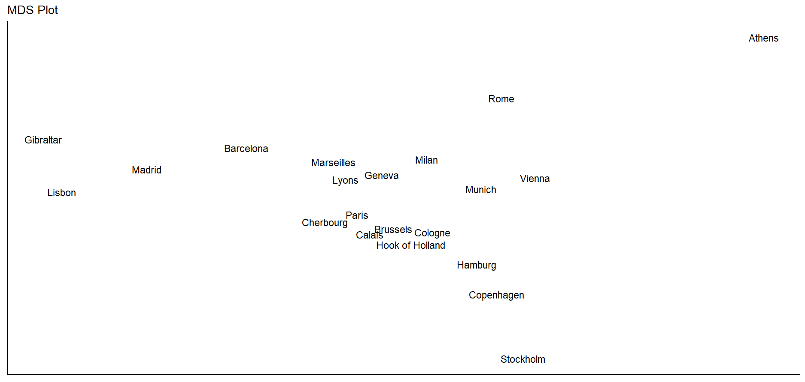

# Day 6 : Multidimensional scaling (MDS) in R

## Ambu Vijayan
### Bioinformatician
### BioLit, Thiruvananthapuram
---

## Multidimensional scaling (MDS) is a visual representation of distances or dissimilarities between sets of objects. “Objects” can be colors, faces, map coordinates, political persuasion, or any kind of a categorical variable.

---
### Multidimensional Scaling (MDS) 

Purpose	: To visualize the similarity or dissimilarity between observations in a high-dimensional data space.

Method : MDS finds a low-dimensional representation of the data based on a similarity or dissimilarity matrix.

Input :	Dissimilarity matrix or proximity matrix.

Output : Low-dimensional scatter plot.

Properties preserved : Distance relationships between observations.

Advantage : Good for visualizing complex relationships between observations.

---

## R has a number of ways to perform metric MDS.:

cmdscale() (stats by R Development Core Team)
smacofSym() (smacof by Jan de Leeuw and Patrick Mair)
wcmdscale() (vegan by Jari Oksanen et al)
pco() (ecodist by Sarah Goslee and Dean Urban)
pco() (labdsv by David W. Roberts)
pcoa() (ape by Emmanuel Paradis et al)
dudi.pco() (ade4 by Daniel Chessel et al)

---

## Installing packages
Except for cmdscale(), the rest of the functions don’t come with the default distribution of R; this means that you have to install their corresponding packages:

### install packages
install.packages(c("vegan", "ecodist", "labdsv", "ape", "ade4", "smacof"))

---

## We will use the dataset eurodist that gives the road distances (in km) between 21 cities in Europe.

### convert eurodist to matrix
euromat = as.matrix(eurodist)

### inspect first five elements
euromat[1:5, 1:5]

---

## MDS with cmdscale()

The most popular function to perform a classical scaling is cmdscale(). 

Its general usage has the following form:

`cmdscale(d, k = 2, eig = FALSE, add = FALSE, x.ret = FALSE)`

---

### MDS 'cmdscale'
`mds1 = cmdscale(eurodist, k = 2)`

### plot
`plot(mds1[,1], mds1[,2], type = "n", xlab = "", ylab = "", axes = FALSE,
     main = "cmdscale (stats)")
text(mds1[,1], mds1[,2], labels(eurodist), cex = 0.9, xpd = TRUE)`

---
# Using ggplot

`library(ggplot2)`

### Perform MDS 
`mds1 = cmdscale(eurodist, k=2)`

### Create dataframe with coordinates and labels
`df <- data.frame(x = mds1[,1], y = mds1[,2], labels = rownames(mds1))`

---

### Plot 
`ggplot(df, aes(x, y, label = labels)) + geom_text() + ggtitle("MDS Plot") + theme_classic() + theme(axis.title.x = element_blank(), axis.title.y = element_blank(), axis.text.x = element_blank(), axis.text.y = element_blank(), axis.ticks = element_blank())`

---

